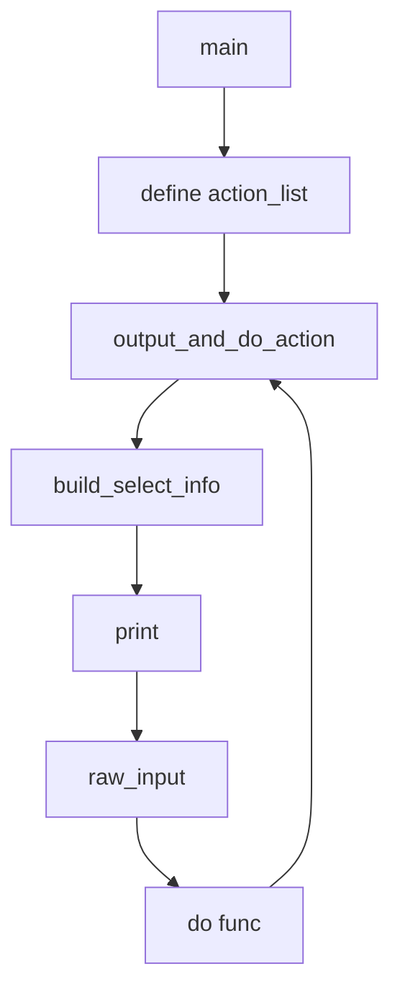

## 1. 背景

本工具主要目的是简化运维工作，包括指导客户现场快速操作等，降低维护人员的学习成本，减少不必要的人为出错。

工具期望有以下功能：

* 对服务的管理（启动、停止）：应用服务、数据库服务等
* 诊断管理（执行、生成报告）
* 安全修改特定的配置文件、数据库字段
* 执行备份、恢复

等等。

## 2. 概要

* 形态：带提示的命令行
* 语言：python
* 版本：2.7+
* 工程：http://192.168.7.141/devop/lfs-admin.git

## 3. 结构

```
lfs-admin/
│
├── lfsadmin/
│     ├── lfsadmin.py  <主程序>
│     ├── <mod 1>.py <模块>
│     ├── <mod 2>.py
│     └── <mod 3>.py
├── tests/
│     ├── test_lfsadmin.py <主程序测试>
│     ├── test_mod1.py <模块测试>
│     ├── test_mod2.py
│     └── test_mod3.py
├── doc/
├── script/
├── .gitignore
├── requirements.txt <依赖库清单>
└── README.md
```

## 3. 开始

**1. 获取代码**

```
git clone http://192.168.7.141/devop/lfs-admin.git
```

**2. 进入目录**

```
cd lfs-admin
```

**3. 安装依赖库**

```
pip install -r requirements.txt
```

**4. 运行程序**

```
cd lfsadmin
python lfsadmin.py
```

## 4. 预览

```
E:\Code\linkapp\lfs-admin> python lfsadmin\lfsadmin.py
(1) start service
(2) stop service
(3) restart service
(4) other

choose : 
```

## 5. 框架

### 5.1. 操作菜单

首先需要定义操作菜单，程序执行时，会首先展示给操作用户，告知可选的操作。这个定义在主函数中，是个list变量：```action_list```

```python
action_list = [
        ('start service', start),
        ('stop service', stop),
        ('restart service', restart),
        ('other', SubCmd([
            ('setting', setting),
            ('diagnose', diagnose)
        ]))
    ]
```

list中的每个元素都是一个```tuple```类型，```tuple```中第一项是要显示的命令，第二项是用户选择这个命令后要执行的函数。

以上定义执行时，终端显示如下：

```
(1) start service
(2) stop service
(3) restart service
(4) other
```

对于需要下一级菜单的，在对应的执行函数处嵌入```SubCmd```即可，如示例中的```other```项。```SubCmd```是一个类，构造时接受一个list，表示子菜单，结构与外层的```action_list```是一样的。

### 5.2. 命令函数

每一个菜单项所对应的命令，可以是一个普通函数，也可以是一个可调用对象（```callable```）。

普通函数是最简单的形态，不需要任何参数与返回值，类似这样：

```python
def start(): 
    print 'start...'
```

如果是用```SubCmd```定义的子菜单项，它的```__call__```则必须要传入一个父菜单的列表，以方便处理返回上一级菜单，所以在程序中有这么一段判断：

```python
if func.__class__.__name__ == 'SubCmd':    
    func(act_list)
else:    
    func()
```

### 5.3. 启动过程

程序执行过程如下：



### 5.4. 模块组织

```fsadmin.py```主要是框架部分，尽量不要在这里涉及到具体的处理细节。命令函数应该集中到各个子模块里去，比如用```service.py```放所有与服务相关的命令处理。然后在```fsadmin.py```将它```import```进来就可以了。类似这样：


```
from service import start, stop
```

然后对应每个子模块都加上对应的单元测试```test_xxxxx.py```

## 6. 指引

### 6.1. 开发菜单项

**1. 添加新模块文件：模块名.py**

**2. 在模块中加入处理函数**

```python
def 处理函数1:
    pass
    
def 处理函数2:
    pass
```

**3. 在lfsadmin.py中导入这些处理函数**

```python
from 模块名 import 处理函数1
from 模块名 import 处理函数2
```

**4. 加入菜单项**

```python
action_list = [
        ...
        ('新增的模块显示名', SubCmd([
            ('操作1', 处理函数1),
            ('操作2', 处理函数2)
        ]))
    ]
```

### 6.2. 编写测试

单元测试除了可以避免缺陷出现，还可以模拟输入输出，使调试更方便。

**1. 新建与模块对应的测试文件：test_模块名.py**

**2. 将测试文件的父目录加入sys.path，使要测试的模块能搜索到**

```python
import os
import sys
current_dir = os.path.abspath(os.path.dirname( __file__))
parent_dir = os.path.abspath(current_dir + "/../")
sys.path.insert( 0, parent_dir)
```

**3. 引入unittest框架**

```python
import unittest
```

**4. 引入要测试的模块**

```python
from lfsadmin.模块名 import 处理函数名
```

**5. 定义测试类**

```python
class 模块名TestCase(unittest.TestCase):
```

**6. 开始写测试代码**

### 6.3. 模拟系统调用

作为一个管理工具，系统中会有大量的操作需要执行shell命令，并读取命令输出。如果直接执行单元测试，会有两方面的问题：

* 执行单元测试的节点上可能并没有所需的shell命令
* 难以多样化命令输出，因而不能完整测试代码的所有分支

通过python的```mock```模块，我们可以模拟shell命令的执行结果，这样就可以快速验证系统。

**1. 导入mock**

```python
import mock
```

**2. 强制某个关键函数返回指定的结果**

```python
commands.getstatusoutput = mock.Mock(return_value=(0, 'OK'))
```

以上代码可以让后续调用```commands.getstatusoutput```时一定返回```(0, 'OK')```，以下是一个比较全面的例子：

```python
class DiagnoseTestCase(unittest.TestCase):
    def test_ok(self):
        commands.getstatusoutput = mock.Mock(return_value=(0, 'OK'))
        ret = diagnose()
        self.assertEqual(True, ret)

    def test_error_msg(self):
        commands.getstatusoutput = mock.Mock(return_value=(0, 'XXXXXXXX'))
        ret = diagnose()
        self.assertEqual(False, ret)

    def test_error_ret(self):
        commands.getstatusoutput = mock.Mock(return_value=(-1, 'OK'))
        ret = diagnose()
        self.assertEqual(False, ret)
```

### 6.4. 进一步提升

* 如果是python2，菜单项中的中文需要特殊处理
* 命令行参数化处理
* 编译成字节码
* 持续集成
* 日志：操作记录
* 超级菜单（隐藏高级功能）

## 7. 规范


## 8. 备注

