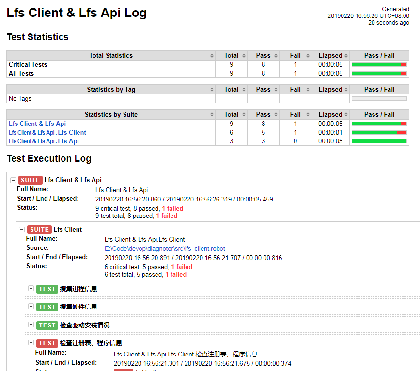

# 诊断工具集


## 背景

随着我们产品功能越来越多、架构越来越庞大，故障排查在我们工作中的比重因而也一直居高不下。长期以来，这一状况既造成了开发资源不必要的耗费，也极大地影响了技术支持人员的工作热情与成就感。事实上，绝大部分的现场问题解决起来都不难，而且往往都是人为疏忽造成的，但排查过程却并不轻松。人的记忆是有限的，我们会忘了做某事、会忘了以前是如何找到问题的。因此，将排查自动化、将诊断经验工具化是势在必行的，通过长期的积累，我们一定能取得丰硕的成果，开发与运维工作都会越来越轻松。

## 效果

* 环境信息搜集
* 安装后检查
* 对比测试、问题排查
* 甚至。。。运维自动化

## 基础

工具集基于Robot Framework，这是一款python编写的功能自动化测试框架。受益于python无比丰富的内置库与第三方库，Robot Framework能帮我们自动执行各种复杂的任务，包括访问网络、数据库、注册表、进程、文件系统等等，拥有广阔的发挥空间。通过对RF与Python的学习，可以极大地扩充运维人员的装备库，彻底发挥出第一道防线的作用。同时，开发人员也可以免去反复索取日志、一遍又一遍地解决同一个问题的烦恼。

合抱之木，生于毫末。每解决一个问题，就将这个排查过程自动化起来。

## 安装

### 系统需求

Python 2.7+

### 步骤

1. 安装Python
2. 进入工具集目录，双击setup.bat，系统将自动安装VE、RF、相应的依赖库，并开启虚拟环境（以后只需双击run.bat启动执行环境）
3. 修改RF脚本中的相应参数（如服务器地址、用户名等）
4. 在命令行中运行相应的脚本，如：

```
robot -d output src\lfs_client.robot
```

5. 在output目录中将生成html版的报告log.html，打开即可查看，如果需要，将这个文件发给开发即可

## 使用

### 项目结构

- doc <文档>
- output <输出结果>
    - log.html <执行日志>
- src <脚本>
    - lfs_api.robot <检查api的执行情况>
    - lfs_client.robot <检查客户端的环境>
    - lfs_server.robot <检查服务器的环境> 
	- lfs_vdisk.robot <检查盘符的环境> 
- venv <虚拟环境>
- README.md <本文档>
- requirements.txt <python依赖库列表>
- run.bat <启动虚拟环境>
- setup.bat <第一次使用时执行的安装文件>

### 脚本编辑

.robot 是文本文件，可直接用文本工具编辑，编辑后保存即可。也可使用可视化的工具协助，如RIDE。

RIDE安装：

```
pip install robotframework-ride
ride.py
```

### 执行脚本

```
robot -d output src\lfs_client.robot
```
其中，*-d* 指定日志输出目录，在本例中是output目录。最后跟的是脚本文件名，可以同时执行多个脚本，如：

```
robot -d output src\lfs_client.robot src\lfs_api.robot
```

## 脚本结构

### Settings段


```
*** Settings ***
Library           psutil
Library           psutil.Process
Library           OperatingSystem
Library           String
Library           Telnet
```


在这一段中主要是指定需要使用的python库，比如在上面的代码中 *psutil* 是一个跨平台的进程库，而OperatingSystem、String、Telnet则是RF自带的库。

###  Test Cases段

```
*** Test Cases ***
搜集进程信息
    @{pids}    psutil.pids
    ${pids_info}    set variable
```

RF把没有缩进的行视为测试用例名，开始缩进后，就是脚本代码了

### Keywords段

```
*** Keywords ***
Login
    ${url_pre}    catenate    SEPARATOR=    http://    ${host}    
```
    
这一段可封装自己的关键字，相当于可反复调用的函数。比如这里就把登录封装也起来，在测试每个api时就可以直接调用，像这样：

```
${session_id}=    Login
```

## 语法

### 变量类型

- ${变量名} 普通变量
- @{变量名} 列表
- &{变量名} 字典

### 流程控制

- 循环

```
    : FOR    ${pid}    IN    @{pids}
```

- 条件执行

```
run keyword if
```

### 其它

- 检查点

```
Should Be Equal    # 检查两个对象是否相等
File Should Exist    # 检查文件是否存在
```

- 执行python指令

```
evaluate
```

## 应用

### 网络相关

- HTTP请求

```
${data}    requests.get    ${url_pre}    params=&{params}
```

- Telent到指定的端口

```
Open Connection    127.0.0.1    port=11000
```

### 本地环境

- 获取环境变量

```
${windir}    Get Environment Variable    windir 
```

- 遍历目录下的文件

```
@{file_list}=    List Files In Directory    ${log_dir}
```

- 获取文件大小

```
${log_size}=    Get File Size    ${last_log_path}
```

- 获取文件内容

```
${log_data}    Get File    ${last_log_path}    encoding=gbk
```

- 获取CPU、内存信息

```
${cpu_count}    psutil.cpu_count
${cpu_times}    psutil.cpu_times
${memory_info}    psutil.virtual_memory
```

- 查看驱动是否存在

```
File Should Exist    ${dokan_driver}
```

- 获取注册表值

```
${cmd_line}    evaluate    win32api.RegQueryValue(win32api.RegOpenKey(-2147483646, 'SOFTWARE\\Classes\\lfsdroid\\shell\\open\\command'),'')    win32api
```

- 获取正在运行的进程列表

```
@{pids}    psutil.pids
: FOR    ${pid}    IN    @{pids}
\    ${p}    evaluate    psutil.Process(${pid})    psutil
\   LOG ${p.name()}
```

### 其它

- 截屏

```
Take Screenshot ts.jpg
```

## 效果

### 脚本执行


### 诊断报告



---


